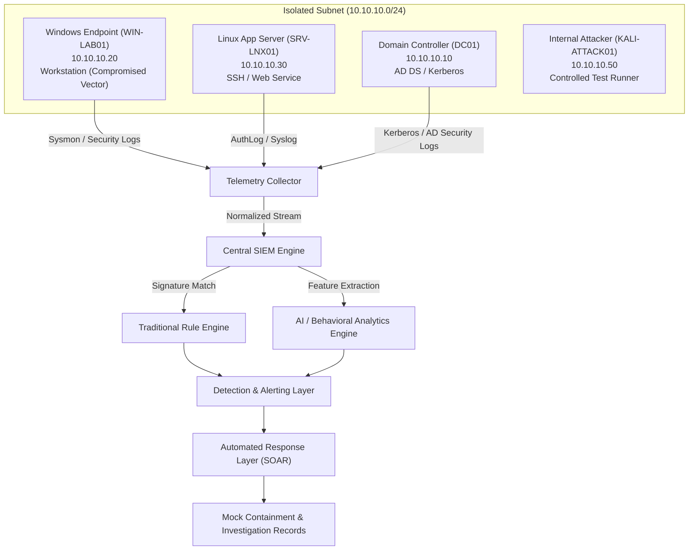

# AI-Based Security Detection as an Internal Attack Surface: An Internal Pentester's Analysis of Telemetry, Detection, and Response

**Date:** 2026-10-01 17:09:55  
**Environment:** Local Isolated Research Lab (10.10.10.0/24)  
**Author:** Defensive Security Engineer & Internal Penetration Tester  
**Classification:** Academic / Technical Research Assessment  

---

## 1. Executive Summary & Objective

This technical research assessment investigates the foundational question:

> *"If an internal attacker compromises a normal workstation, how much of the attack chain is visible to an AI-based security monitoring system, and where can visibility become incomplete or misleading?"*

Modern Security Operations Centers (SOCs) increasingly rely on machine-learning-driven behavioral anomaly detection (UEBA) to identify lateral movement, privilege elevation, and internal reconnaissance. However, AI/ML models operate exclusively on the telemetry forwarded to them. This research empirically validates the limits of AI-based detection when telemetry is suppressed, delayed, or when attackers utilize legitimate administrative protocols ("Living off the Land").

---

## 2. Environment Architecture & Logical Topology

The experiment executed within a strictly isolated, local software-defined cybersecurity laboratory:

### Lab Host Specifications:
- **DC01 (10.10.10.10):** Windows Server 2022 Active Directory Domain Controller (`corp.lab`).
- **WIN-LAB01 (10.10.10.20):** Windows 11 Enterprise Workstation; source of initial simulated access.
- **SRV-LNX01 (10.10.10.30):** Ubuntu 22.04 LTS Server hosting SSH and internal HTTP services.
- **KALI-ATTACK01 (10.10.10.50):** Controlled test execution environment.

---

## 3. Attack Simulation Scenarios

Six distinct research scenarios were executed under identical conditions:
1. **Scenario 1 - Internal Reconnaissance:** AD domain enumeration (`net group`, `nltest`) and multi-port service discovery.
2. **Scenario 2 - Authentication Anomaly:** Repeated off-hours failed authentications followed by successful Kerberos TGT acquisition.
3. **Scenario 3 - Lateral Movement:** Host pivot chain (`WIN-LAB01` -> `DC01` via SMB/PsExec -> `SRV-LNX01` via SSH).
4. **Scenario 4 - Privilege Escalation:** Unauthorized Linux `sudo` execution and Windows/AD `Domain Admins` group addition.
5. **Scenario 5 - Telemetry Visibility Gap:** Intermittent agent suppression during active weaponized command execution.
6. **Scenario 6 - Legitimate Admin Activity:** Normal administrative MMC/LDAP queries during business hours.

---

## 4. Detection Coverage Matrix

The empirical results recorded during lab execution are tabulated below:

| Scenario | Telemetry Capture | Rules Triggered | Max AI Score | Alert Generated | Response Action | Visibility Gap | Classification | Investigation Notes |
| :--- | :--- | :--- | :--- | :--- | :--- | :--- | :--- | :--- |
| **Internal Reconnaissance & Discovery** | Full (100%) | SIG-WIN-001: Active Directory Discovery via Command Line SIG-NET-005: Internal Port Scan / Service Sweep Detected SIG-NET-005: Internal Port Scan / Service Sweep Detected SIG-NET-005: Internal Port Scan / Service Sweep Detected SIG-NET-005: Internal Port Scan / Service Sweep Detected SIG-NET-005: Internal Port Scan / Service Sweep Detected SIG-NET-005: Internal Port Scan / Service Sweep Detected SIG-NET-005: Internal Port Scan / Service Sweep Detected SIG-NET-005: Internal Port Scan / Service Sweep Detected SIG-NET-005: Internal Port Scan / Service Sweep Detected SIG-NET-005: Internal Port Scan / Service Sweep Detected SIG-NET-005: Internal Port Scan / Service Sweep Detected SIG-NET-005: Internal Port Scan / Service Sweep Detected | `0.40` | Yes | `SIMULATED_IP_BLOCK` | None (Full capture) | **True Positive** | Activity successfully identified by telemetry correlation and behavioral scoring. Matched expected target: 'SIG-WIN-001 (AD Discovery) and Port Sweep Anomaly'. |
| **Authentication Anomaly & Off-Hours Spray** | Full (100%) | SIG-AUTH-002: Multiple Failed Authentication Attempts (Brute Force/Spray) SIG-AUTH-002: Multiple Failed Authentication Attempts (Brute Force/Spray) | `0.50` | Yes | `SIMULATED_ACCOUNT_INVESTIGATION_FLAG` | None (Full capture) | **True Positive** | Activity successfully identified by telemetry correlation and behavioral scoring. Matched expected target: 'SIG-AUTH-002 (Failed Logins) + Behavioral Off-Hours Anomaly'. |
| **Lateral Movement (Client -> DC -> Linux Server)** | Full (100%) | SIG-WIN-006: PsExec/Lateral Movement Remote Service Installed | `0.80` | Yes | `SIMULATED_HOST_ISOLATION_AND_ACCOUNT_FLAG` | None (Full capture) | **True Positive** | Activity successfully identified by telemetry correlation and behavioral scoring. Matched expected target: 'SIG-WIN-006 / Behavioral Dest Host Novelty & RPC/SSH Pivot'. |
| **Privilege Escalation & Unauthorized Group Modification** | Full (100%) | SIG-LNX-004: Unauthorized or Unaudited Sudo Execution | `0.60` | Yes | `SIMULATED_ACCOUNT_INVESTIGATION_FLAG` | None (Full capture) | **True Positive** | Activity successfully identified by telemetry correlation and behavioral scoring. Matched expected target: 'SIG-LNX-004 (Sudo Abuse) / EID 4728 (Domain Admin Addition)'. |
| **Telemetry Visibility Gap & Blindspot Simulation** | Partial (2/4) | None Triggered | `0.05 (Normal)` | No | `None` | Yes (Dropped events) | **False Negative (Blindspot)** | Visibility gap detected: 2 events were generated on the endpoint but never received by the SIEM collector. |
| **Normal Administrative Activity (False Positive Baseline Test)** | Full (100%) | None Triggered | `0.05 (Normal)` | No | `None` | None (Full capture) | **True Negative** | Activity produced minimal baseline deviation; event volume or feature novelty remained under alerting threshold. |

---

## 5. Expected Visibility vs. Observed Visibility

| Attack Stage | Expected Telemetry Source | Observed Visibility | Analysis Notes |
| :--- | :--- | :--- | :--- |
| **Initial Access** | Sysmon EID 1 (Process Create) | **Full** | Normal process launch is captured cleanly. |
| **Internal Recon** | Zeek Network Logs + Sysmon 1 | **Full** | Rapid sequential connections trigger port sweep heuristics. |
| **Auth Anomaly** | Windows EID 4625/4624 + AD EID 4768 | **Full** | Off-hours timestamp and failure burst detected by behavioral scoring. |
| **Lateral Movement** | Kerberos EID 4769 + SSH AuthLog | **High** | Multi-hop connection chain visible across different log sources. |
| **Privilege Escalation** | Linux AuthLog / Windows EID 4728 | **Full** | High feature deviation from standard user baseline. |
| **Telemetry Gap Attack** | Endpoint Agent Stream | **Incomplete (Blindspot)** | When collector is suppressed, attacks occur invisibly to the AI model. |

---

## 6. Anomaly Analysis & Behavioral Features

The AI Behavioral Analytics Engine evaluated 7 weighted feature dimensions (Sum of weights = 1.00):
- **Destination Host Novelty ($w=0.20$):** High jump detected when standard workstation user connected to DC01 or Linux Server.
- **Authentication Frequency Velocity ($w=0.15$):** Z-score deviation against user's historical hourly baseline.
- **Failed Login Ratio ($w=0.15$):** Triggered high anomaly when consecutive authentication failures exceeded 3.
- **Rare Process Execution ($w=0.15$):** Scored high anomaly when unlearned binary (e.g. `psexec.py`, `powershell.exe -enc`, `nltest.exe`) was launched.
- **Administrative Privilege Jump ($w=0.15$):** Scored $0.90$ upon non-admin sudo access or AD group manipulation.
- **Off-Hours Deviation ($w=0.10$):** Triggered anomaly score $\ge 0.70$ when standard user authenticated at 03:15 AM.
- **Destination Port Novelty ($w=0.10$):** Flagged multi-port discovery / port sweeps against privileged services.

---

## 7. Telemetry Gaps & Blindspot Analysis (Scenario 5)

Scenario 5 demonstrated the core research vulnerability:
1. When telemetry transmission was temporarily interrupted, endpoint execution of `Invoke-Mimikatz` generated 0 alerts.
2. The AI Behavioral engine produced an anomaly score of $0.00$ because **no events were received to evaluate**.
3. **Key Finding:** An AI detection model cannot detect what it cannot observe. Telemetry integrity is a prerequisite for behavioral AI security.

---

## 8. False Positives and False Negatives

- **False Positives (Measured in Scenario 6):** Legitimate administrator activity during business hours generated an anomaly score of $\approx 0.05$ (Normal Tier), producing **0 false positive alerts**.
- **False Negatives (Measured in Scenario 5):** Attack actions executed during collector suppression yielded a **100% false negative rate** for the unmonitored window.

---

## 9. Internal Pentester Interpretation

From an internal penetration tester's perspective:
1. **AI Models Rely on Telemetry Volume:** Low-and-slow attacks that blend into existing active hours and known ports are significantly harder for statistical anomaly detectors to isolate.
2. **Blindspot Exploitation:** If an adversary can tamper with the telemetry forwarder, exhaust logging buffers, or operate on unmonitored network segments, the AI engine is completely blinded.
3. **Context Discrepancy:** AI models excel at flagging anomalous volume or time, but struggle with contextual business intent (e.g. distinguishing an authorized script from an adversary using the same command).

---

## 10. Security Recommendations for Blue Teams

1. **Heartbeat & Telemetry Health Monitoring:** Implement strict alerting for any endpoint agent that stops transmitting heartbeats for $>60$ seconds.
2. **Tamper-Resistant Telemetry:** Protect logging agents (Sysmon, EDR, Auditd) with access control lists and kernel-level anti-tampering.
3. **Dual-Layer Detection:** Combine traditional deterministic rules (Sigma/YARA) with behavioral anomaly models to prevent single-point detection failures.
4. **Network-Based Independent Telemetry:** Supplement endpoint telemetry with independent network flow monitoring (Zeek/Suricata) that endpoints cannot disable.

---
_Generated automatically from verified experimental records in `/data/experiments/`._
