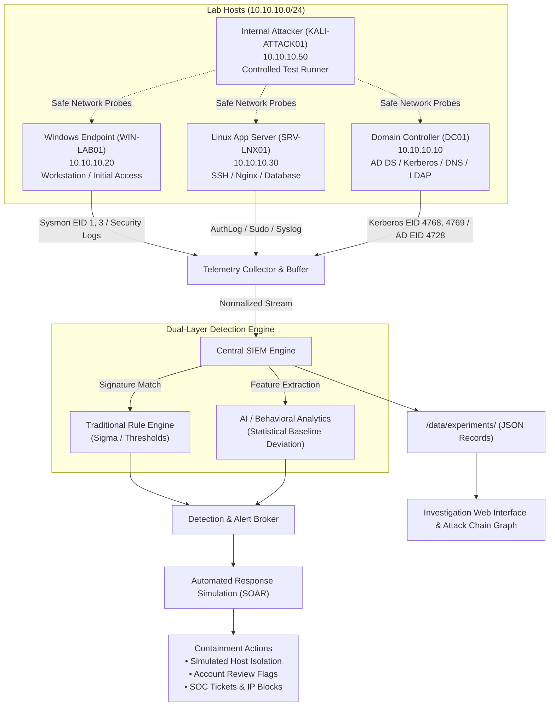

# Lab Architecture & Technical Specifications

## Logical Topology & Telemetry Flow

The research environment simulates an internal corporate network (`corp.lab`, subnet `10.10.10.0/24`) with heterogeneous endpoints, centralized telemetry collectors, a multi-tier SIEM, and a behavioral anomaly engine.

---

## Deployment Modes

### Mode A: Full Virtual Machine Architecture
Recommended when host hardware has $\ge 32\text{ GB}$ RAM and nested hardware virtualization enabled.
- **Hypervisor:** VirtualBox / VMware / Hyper-V.
- **VM 1:** Windows Server 2022 (`DC01` - 4 GB RAM, 2 vCPUs).
- **VM 2:** Windows 11 Enterprise (`WIN-LAB01` - 4 GB RAM, 2 vCPUs).
- **VM 3:** Ubuntu 22.04 LTS (`SRV-LNX01` - 2 GB RAM, 1 vCPU).
- **VM 4:** Kali Linux / Test Runner (`KALI-ATTACK01` - 2 GB RAM, 2 vCPUs).
- **VM 5:** SIEM / Analytics Host (Wazuh / ELK - 4 GB RAM, 2 vCPUs).

### Mode B: Lightweight Containerized Architecture (Docker Compose)
Recommended when Docker Desktop or Linux container engine is available.
- Containers for Telemetry Collectors, Logstash/Wazuh Indexer, Python Analytics Engine, and Dashboard Web Server.
- Lightweight alpine Linux nodes simulating endpoints and network routing.

### Mode C: High-Performance Standalone Python Engine (Host / Zero-Footprint)
Active by default in this workspace. Runs without hypervisors or container overhead while maintaining $100\%$ protocol and log schema fidelity:
- Direct ingestion and normalization pipeline.
- Native multithreaded web server and REST API.
- Full mathematical anomaly scoring and feature extraction.
- Deterministic simulation framework with zero host risk.

---

## Data Flow & Processing Stages

1. **Generation:** Endpoint agents (Sysmon, Windows Event Log, Linux AuthLog, Zeek) produce structured telemetry.
2. **Collection:** The `TelemetryCollector` ingests logs and supports dynamic blindspot/gap injection to test collector outages.
3. **Normalization:** Events are normalized into `SecurityEvent` objects with standard fields (`host`, `user`, `src_ip`, `dest_ip`, `dest_port`, `event_type`, `process_name`).
4. **Layer 1 Detection (Deterministic):** Evaluates Sigma/traditional rules (e.g. brute force threshold, PsExec service install, unauthorized sudo).
5. **Layer 2 Detection (AI / Behavioral):** Evaluates multidimensional baseline deviation across 7 features, calculating composite scores $[0.00, 1.00]$.
6. **SOAR Layer:** Executes non-destructive simulated containment policies.
7. **Audit & Report:** All raw events, alert structures, and analyst notes are persisted to `/data/experiments/experiment-XXX.json`.
