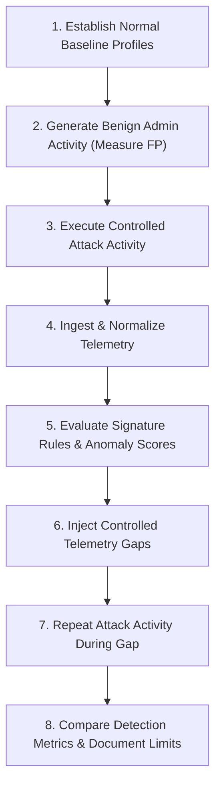

# Scientific Research Methodology

## Research Philosophy & Impartiality

The purpose of this laboratory is **not** to advocate for or against AI security solutions. The objective is to rigorously and empirically determine:
- Where AI-based security detection operates effectively.
- Where AI-based security detection fails or produces misleading results.
- What specific telemetry dependencies are mandatory for detection viability.
- How an internal penetration tester can systematically validate these architectural boundaries.

---

## Controlled Experimental Workflow

1. **Baseline Establishment:** Normal behavioral profiles are generated for every lab user based on typical operating hours, ports, and binaries.
2. **False Positive Benchmarking:** Benign administrative actions are run to establish baseline noise and ensure low-risk routines do not trigger false alerts.
3. **Controlled Attack Injection:** Standard attacker techniques (recon, spray, lateral movement, privilege elevation) are injected under 100% telemetry visibility.
4. **Telemetry Blindspot Testing:** Logging channels are temporarily suppressed to observe detection model resilience when telemetry is lost.
5. **Evidence Preservation:** Every metric is computed dynamically from recorded logs rather than predetermined assertions.
